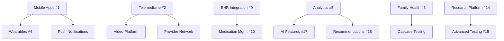

# Missing Product Features - Master Index

**Document Suite**: Fair Underwriting Product Feature Specifications
**Total Features**: 24
**Last Updated**: November 7, 2025
**Status**: Documentation In Progress

---

## Overview

This document suite catalogues all missing product features identified for Fair Underwriting. Each feature has been systematically analyzed with:

- Executive summary
- User stories
- Technical specifications
- Success metrics
- Budget estimates
- Implementation timeline

---

## Feature Catalog

### 🚨 Critical Missing Features (Phase 1 - Must Have)

| #     | Feature Name                                                               | Category         | Est. Effort | Budget     | Status         |
| ----- | -------------------------------------------------------------------------- | ---------------- | ----------- | ---------- | -------------- |
| **1** | [Native Mobile Applications](./MISSING_FEATURES_01_MOBILE_APPS.md)         | Mobile           | 6-9 months  | $428K      | ✅ Documented  |
| **2** | [Telemedicine Integration](./MISSING_FEATURES_02_TELEMEDICINE.md)          | Clinical         | 3-4 months  | $557K/year | ✅ Documented  |
| **3** | [Family Health Management](./MISSING_FEATURES_03_FAMILY_HEALTH.md)         | Customer Portal  | 2-3 months  | $85K       | 📝 To Document |
| **4** | [Wearable & IoT Integration](./MISSING_FEATURES_04_WEARABLES.md)           | Data Integration | 3-4 months  | $120K      | 📝 To Document |
| **5** | [Advanced Customer Analytics](./MISSING_FEATURES_05_CUSTOMER_ANALYTICS.md) | Data Science     | 4-5 months  | $180K      | 📝 To Document |

### 📱 Customer Portal Enhancements (Phase 2 - Should Have)

| #      | Feature Name                                                                | Category  | Est. Effort | Budget | Status         |
| ------ | --------------------------------------------------------------------------- | --------- | ----------- | ------ | -------------- |
| **6**  | [Community & Support Forums](./MISSING_FEATURES_06_COMMUNITY.md)            | Social    | 2-3 months  | $75K   | 📝 To Document |
| **7**  | [Educational Content Platform](./MISSING_FEATURES_07_EDUCATION.md)          | Content   | 3-4 months  | $110K  | 📝 To Document |
| **8**  | [Lifestyle & Wellness Tools](./MISSING_FEATURES_08_WELLNESS.md)             | Health    | 3-4 months  | $95K   | 📝 To Document |
| **9**  | [Healthcare Provider Integration](./MISSING_FEATURES_09_EHR_INTEGRATION.md) | Technical | 4-6 months  | $200K  | 📝 To Document |
| **10** | [Medication Management](./MISSING_FEATURES_10_MEDICATION.md)                | Clinical  | 2-3 months  | $80K   | 📝 To Document |

### 🏢 Partner Portal Enhancements (Phase 2 - Should Have)

| #      | Feature Name                                                             | Category  | Est. Effort | Budget | Status         |
| ------ | ------------------------------------------------------------------------ | --------- | ----------- | ------ | -------------- |
| **11** | [Advanced Partner Analytics](./MISSING_FEATURES_11_PARTNER_ANALYTICS.md) | Analytics | 3-4 months  | $140K  | 📝 To Document |
| **12** | [Partner Customization Tools](./MISSING_FEATURES_12_CUSTOMIZATION.md)    | Platform  | 2-3 months  | $90K   | 📝 To Document |
| **13** | [Member Engagement Tools](./MISSING_FEATURES_13_ENGAGEMENT.md)           | Marketing | 2-3 months  | $70K   | 📝 To Document |

### 🔬 Clinical & Research Features (Phase 2-3)

| #      | Feature Name                                                             | Category   | Est. Effort | Budget | Status         |
| ------ | ------------------------------------------------------------------------ | ---------- | ----------- | ------ | -------------- |
| **14** | [Research Participation Platform](./MISSING_FEATURES_14_RESEARCH.md)     | Research   | 3-4 months  | $125K  | 📝 To Document |
| **15** | [Advanced Testing Options](./MISSING_FEATURES_15_ADVANCED_TESTING.md)    | Laboratory | 4-6 months  | $250K  | 📝 To Document |
| **16** | [Longitudinal Health Tracking](./MISSING_FEATURES_16_HEALTH_TRACKING.md) | Clinical   | 3-4 months  | $105K  | 📝 To Document |

### 🤖 AI & Automation Features (Phase 3 - Nice to Have)

| #      | Feature Name                                                            | Category | Est. Effort | Budget | Status         |
| ------ | ----------------------------------------------------------------------- | -------- | ----------- | ------ | -------------- |
| **17** | [AI-Powered Features](./MISSING_FEATURES_17_AI_FEATURES.md)             | AI/ML    | 4-6 months  | $220K  | 📝 To Document |
| **18** | [Intelligent Recommendations](./MISSING_FEATURES_18_RECOMMENDATIONS.md) | AI/ML    | 2-3 months  | $95K   | 📝 To Document |

### 💳 Financial & Billing Features (Phase 2)

| #      | Feature Name                                                             | Category | Est. Effort | Budget | Status         |
| ------ | ------------------------------------------------------------------------ | -------- | ----------- | ------ | -------------- |
| **19** | [Flexible Payment Options](./MISSING_FEATURES_19_PAYMENTS.md)            | Billing  | 2-3 months  | $70K   | 📝 To Document |
| **20** | [Partner Billing Enhancements](./MISSING_FEATURES_20_PARTNER_BILLING.md) | Finance  | 2 months    | $50K   | 📝 To Document |

### 🔐 Security & Compliance Features (Phase 2)

| #      | Feature Name                                                       | Category   | Est. Effort | Budget | Status         |
| ------ | ------------------------------------------------------------------ | ---------- | ----------- | ------ | -------------- |
| **21** | [Advanced Security Features](./MISSING_FEATURES_21_SECURITY.md)    | Security   | 3-4 months  | $130K  | 📝 To Document |
| **22** | [Regulatory Compliance Tools](./MISSING_FEATURES_22_COMPLIANCE.md) | Compliance | 2-3 months  | $85K   | 📝 To Document |

### 🌍 Internationalization Features (Phase 3+)

| #      | Feature Name                                                        | Category | Est. Effort | Budget | Status         |
| ------ | ------------------------------------------------------------------- | -------- | ----------- | ------ | -------------- |
| **23** | [Global Expansion Features](./MISSING_FEATURES_23_INTERNATIONAL.md) | Platform | 6-8 months  | $300K  | 📝 To Document |

### 📊 Undocumented Infrastructure Features

| #      | Feature Name                                                          | Category   | Est. Effort | Budget | Status         |
| ------ | --------------------------------------------------------------------- | ---------- | ----------- | ------ | -------------- |
| **24** | [Operational Infrastructure](./MISSING_FEATURES_24_INFRASTRUCTURE.md) | Operations | 2-4 months  | $110K  | 📝 To Document |

---

## Summary Statistics

### By Phase

- **Phase 1 (MVP)**: 5 features, ~$1.37M total investment
- **Phase 2 (Year 1)**: 13 features, ~$1.48M total investment
- **Phase 3 (Year 2+)**: 6 features, ~$850K total investment

**Grand Total**: ~$3.7M over 2-3 years

### By Category

| Category                | Features | Total Budget |
| ----------------------- | -------- | ------------ |
| Mobile                  | 1        | $428K        |
| Clinical/Medical        | 5        | $1.12M       |
| Analytics & AI          | 4        | $635K        |
| Customer Experience     | 6        | $540K        |
| Partner Tools           | 3        | $300K        |
| Financial               | 2        | $120K        |
| Security & Compliance   | 2        | $215K        |
| Platform/Infrastructure | 3        | $360K        |

### By Effort

| Effort Range | Feature Count |
| ------------ | ------------- |
| 2-3 months   | 10 features   |
| 3-4 months   | 9 features    |
| 4-6 months   | 4 features    |
| 6+ months    | 1 feature     |

---

## Implementation Roadmap

### Q1 2026 (Months 1-3)

**Focus**: Critical customer-facing features

1. ✅ Mobile Apps (iOS/Android) - Start development
2. ✅ Telemedicine Integration - Start development
3. Family Health Management - Start planning
4. Wearables Integration - Start planning

**Budget**: ~$350K
**Team**: 5 developers, 1 designer, 1 medical compliance

### Q2 2026 (Months 4-6)

**Focus**: Complete Phase 1, start Phase 2

5. Advanced Customer Analytics - Start development
6. Community Forums - Start development
7. Educational Platform - Start development
8. Continue Mobile Apps & Telemedicine

**Budget**: ~$400K
**Team**: 7 developers, 1 data scientist, 1 content manager

### Q3 2026 (Months 7-9)

**Focus**: Partner tools and clinical features

9. EHR Integration - Start development
10. Partner Analytics - Start development
11. Medication Management - Start development
12. Launch Mobile Apps (Beta)

**Budget**: ~$350K
**Team**: 8 developers, 1 PM

### Q4 2026 (Months 10-12)

**Focus**: Wellness, engagement, and research

13. Wellness Tools - Start development
14. Engagement Tools - Start development
15. Research Platform - Start development
16. Launch Telemedicine (Pilot)

**Budget**: ~$300K
**Team**: 8 developers, 1 clinical researcher

### 2027 (Year 2)

**Focus**: AI, advanced features, international expansion

17-24. All remaining features

- AI-powered features
- Advanced testing options
- International expansion
- Advanced security

**Budget**: ~$1.3M
**Team**: 10-12 developers, 2 data scientists, international team

---

## Resource Requirements

### Development Team (Peak Staffing - Q3 2026)

| Role                       | Count  | Annual Cost     |
| -------------------------- | ------ | --------------- |
| Senior Backend Developer   | 3      | $420K           |
| Senior Frontend Developer  | 2      | $260K           |
| Mobile Developer (iOS)     | 1      | $150K           |
| Mobile Developer (Android) | 1      | $150K           |
| Data Scientist/ML Engineer | 1      | $160K           |
| DevOps Engineer            | 1      | $140K           |
| QA Engineer                | 2      | $200K           |
| UI/UX Designer             | 1      | $120K           |
| Product Manager            | 1      | $140K           |
| **Total**                  | **13** | **$1.74M/year** |

### Support Team

| Role                          | Count | Annual Cost    |
| ----------------------------- | ----- | -------------- |
| Medical Compliance Specialist | 1     | $110K          |
| Genetic Counselor             | 2     | $200K          |
| Clinical Content Manager      | 1     | $90K           |
| Customer Support (Tier 2)     | 2     | $140K          |
| **Total**                     | **6** | **$540K/year** |

### **Total Annual Operational Cost**: ~$2.28M/year (peak)

---

## Risk Analysis

### Top 5 Risks Across All Features

| Risk                                | Probability | Impact   | Mitigation Strategy                                        |
| ----------------------------------- | ----------- | -------- | ---------------------------------------------------------- |
| **1. Regulatory Compliance Delays** | High        | Critical | Hire compliance specialist early, engage FDA counsel       |
| **2. Integration Complexity**       | High        | High     | Use proven APIs (Epic, Cerner), allocate extra time        |
| **3. Talent Acquisition**           | Medium      | High     | Competitive salaries, remote-first, contractor flexibility |
| **4. Scope Creep**                  | High        | Medium   | Strict phase gates, MVP-first approach                     |
| **5. Security Vulnerabilities**     | Medium      | Critical | Regular penetration testing, bug bounty program            |

---

## Success Criteria

### Customer Adoption

- **Mobile App Install Rate**: 60% of customers within 30 days
- **Telemedicine Usage**: 40% of customers use at least once per year
- **Feature Engagement**: Average customer uses 5+ features regularly

### Business Impact

- **Customer Satisfaction (NPS)**: 65+ (from baseline 50)
- **Customer Retention**: 85% annual retention (from baseline 75%)
- **Cost Savings**: $50 per customer per year in operational efficiencies

### Technical Performance

- **System Uptime**: 99.9% across all new features
- **API Response Time**: < 200ms (95th percentile)
- **Mobile App Crash Rate**: < 0.5%

---

## Next Steps

### Immediate Actions (This Week)

1. [ ] Review and approve feature priorities with executive team
2. [ ] Finalize budget allocation for Q1 2026
3. [ ] Begin hiring process for critical roles (mobile developers, medical compliance)
4. [ ] Schedule architecture review sessions for top 5 features

### Short-term (Next Month)

5. [ ] Complete detailed specifications for features #3-5
6. [ ] Vendor selection (Twilio for video, Surescripts for e-prescribing)
7. [ ] Create detailed project plans for Mobile Apps & Telemedicine
8. [ ] Establish feature flagging strategy (gradual rollouts)

### Medium-term (Next Quarter)

9. [ ] Launch alpha testing program for early features
10. [ ] Build internal tools team (feature flag dashboard, A/B testing)
11. [ ] Create feature adoption tracking dashboard
12. [ ] Begin Phase 2 planning (features #6-13)

---

## Document Navigation

### Fully Documented Features

- **[Feature #1: Native Mobile Applications](./MISSING_FEATURES_01_MOBILE_APPS.md)** ✅
  - _iOS & Android apps with push notifications, biometrics, offline mode, barcode scanning_
  - _Effort: 6-9 months | Budget: $428K | Team: 2 mobile devs, 1 backend dev, 1 designer_

- **[Feature #2: Telemedicine Integration](./MISSING_FEATURES_02_TELEMEDICINE.md)** ✅
  - _Video consultations with genetic counselors, pulmonologists, hepatologists_
  - _Effort: 3-4 months | Budget: $557K/year | Team: Backend dev, frontend dev, medical compliance_

### To Be Documented (Features #3-24)

Specifications will be created systematically. Request detailed documentation for any feature by number.

**Example Request**: "Please document Feature #3: Family Health Management in detail"

---

## Appendix A: Feature Dependencies

---

## Appendix B: Technology Stack Decisions

| Feature Category | Technology Choices            | Rationale                                 |
| ---------------- | ----------------------------- | ----------------------------------------- |
| **Mobile**       | Swift (iOS), Kotlin (Android) | Native performance, platform features     |
| **Video**        | Twilio Video                  | HIPAA-compliant, reliable, excellent docs |
| **Wearables**    | Apple HealthKit, Google Fit   | Official platform APIs                    |
| **AI/ML**        | Python (TensorFlow, PyTorch)  | Industry standard, mature libraries       |
| **EHR**          | Epic FHIR, Cerner Ignite      | Market leaders, standard APIs             |
| **Payments**     | Stripe                        | Developer-friendly, PCI-compliant         |
| **Analytics**    | Segment + Mixpanel            | Flexible event tracking                   |

---

**Document Owner**: CTO, CPO
**Review Cycle**: Quarterly
**Last Major Update**: November 7, 2025
**Next Review**: February 2026

---

## Questions or Feedback?

For detailed specifications on any feature, reference the individual feature document or contact:

- **Technical Questions**: CTO (cto@fairunderwriting.com)
- **Product Questions**: CPO (cpo@fairunderwriting.com)
- **Budget Questions**: CFO (cfo@fairunderwriting.com)
